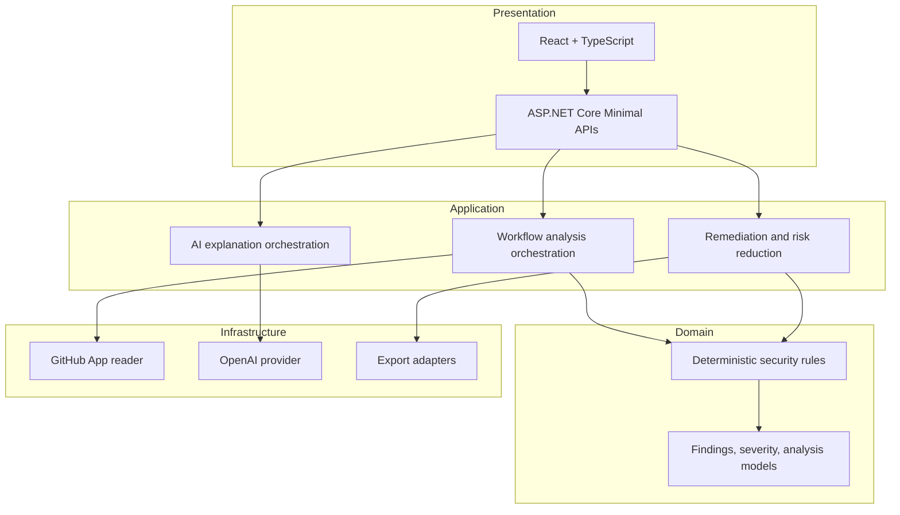
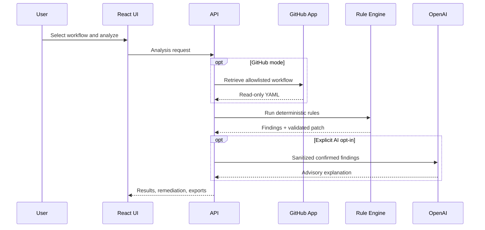

# Architecture

## Overview

DevSecOps Sentinel follows Clean Architecture pragmatically. Dependencies point inward toward stable application and domain contracts, while GitHub, OpenAI, export formatting, and HTTP concerns remain at the edges.

## Request pipeline

## Security design

- GitHub App permissions are limited to read-only code and metadata.
- Installation tokens are short lived and cached only in memory.
- An application-level repository allowlist adds a second boundary.
- OpenAI receives sanitized excerpts and deterministic findings only.
- AI output is validated and treated as advisory.
- The deterministic engine re-analyzes proposed YAML before declaring a patch valid.
- Correlation IDs, rate limiting, output caching, security headers, and RFC 7807 errors support operations without logging secrets or workflow bodies.

## Deliberate exclusions

The v1.0 application does not create branches, commits, pull requests, merges, or scheduled repository scans. Those features would require a separate threat model, stronger owner authentication, new GitHub permissions, and explicit human approval.
