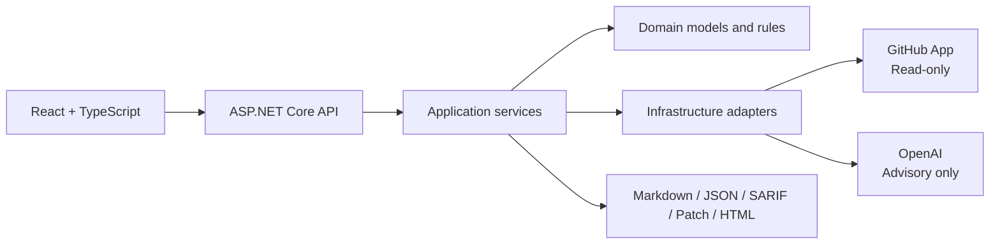

# DevSecOps Sentinel

**DevSecOps Sentinel** is a portfolio-grade GitHub Actions security analyzer built with .NET 10, React, TypeScript, a read-only GitHub App, and optional OpenAI guidance.

It combines deterministic rules with advisory AI explanations, validated remediation previews, risk-reduction reporting, and exportable security evidence—without modifying repositories.


## Why this project matters

Many security demos let an LLM decide what is vulnerable. DevSecOps Sentinel uses the opposite trust model:

1. Deterministic rules identify findings and severity.
2. Proposed changes are re-analyzed before being shown as valid.
3. OpenAI explains confirmed findings but cannot create findings, change severity, or apply patches.
4. GitHub access is restricted to a read-only GitHub App and an application allowlist.

The interesting part is not the explanations the model returns — the rules
already carry a description and a recommendation, and the deterministic
fallback produces comparable prose with no model call at all. It is the
enforcement around the model. The response is constrained by a strict JSON
schema, and the rule identifiers it returns must match the deterministic set
exactly; a reply that invents a finding, drops one, or renames a rule is
rejected and the fallback is used instead. The model cannot widen the result,
only describe it.

That constraint is the reason live AI can be enabled on a security tool at all,
and it is what the project is actually demonstrating.

## Capabilities

- Analyze embedded scenarios or real allowlisted GitHub workflows
- Detect eleven classes of GitHub Actions weakness:

  | Rule | Detects | Severity |
  | --- | --- | --- |
  | GHA001 | Action reference not pinned to a commit SHA | High |
  | GHA002 | Excessive token permissions | High |
  | GHA003 | Job without a timeout | Medium |
  | GHA004 | `pull_request_target` trigger needing review | Critical |
  | GHA005 | Untrusted expression interpolated into a script body | Critical |
  | GHA006 | Checkout leaving the job token on the runner | Medium |
  | GHA007 | Privileged trigger checking out pull-request code | Critical |
  | GHA008 | Reusable workflow call forwarding every secret | High |
  | GHA009 | No declared token permissions at any scope | Medium |
  | GHA010 | Self-hosted runner reachable from a pull request | High |
  | GHA011 | `workflow_run` job consuming an untrusted artifact | High |
- Generate deterministic remediation previews and unified diffs
- Re-analyze proposed YAML and report resolved and remaining findings
- Calculate before/after risk reduction
- Export Markdown, JSON, SARIF, patch, and printable HTML reports
- Add optional Mock or Live OpenAI explanations
- Enforce read-only GitHub access with short-lived installation tokens
- Run unit, integration, frontend, package-audit, repository-protection, and smoke-test gates

## Product screenshots

### Live OpenAI explanation for a vulnerable workflow


### Safe workflow with zero deterministic findings


The safe-workflow result is important: the AI agrees with the deterministic engine instead of inventing vulnerabilities.

## Architecture



See [ARCHITECTURE.md](ARCHITECTURE.md) for the full design.

## Trust boundaries

- **Deterministic first:** rules are authoritative.
- **AI advisory only:** AI cannot create findings, modify severity, or apply fixes.
- **GitHub read-only:** no branch, commit, pull-request, merge, or repository-update operation is implemented.
- **Allowlisted repositories only:** GitHub installation access and application configuration must both permit the repository.
- **Secrets remain server-side:** API keys and GitHub private-key paths are stored outside source control.

## Technology stack

- .NET 10 / ASP.NET Core Minimal APIs
- React 19, TypeScript 5.9, Vite 7
- xUnit, Vitest, Testing Library
- Official OpenAI .NET SDK
- GitHub App installation authentication
- Scalar API reference and OpenAPI
- PowerShell release, audit, and smoke-test scripts

## Quick start

```powershell
pwsh -ExecutionPolicy Bypass
cd C:\DevSecOpsSentinel

.\scripts\setup-local.ps1
.\scripts\run-all.ps1
```

Start the API:

```powershell
dotnet run --project .\src\DevSecOpsSentinel.Api
```

Start the frontend in another window:

```powershell
cd .\src\devsecops-sentinel-web
npm run dev
```

Open:

- Frontend: `http://localhost:5173`
- API: `https://localhost:7001`
- Scalar: `https://localhost:7001/scalar`

## Configuration

The deterministic analyzer and bundled scenarios run without live external
services by default. OpenAI, GitHub repository access, and GitHub action
tag-to-SHA resolution are separate explicit opt-ins.

- OpenAI defaults to `Mock` mode.
- GitHub integration defaults to disabled.
- Live credentials belong in .NET User Secrets or production secret storage.

Detailed setup:

- [OpenAI integration](docs/openai-integration.md)
- [GitHub read-only integration](docs/github-read-only-integration.md)
- [Operations guide](OPERATIONS.md)

## Validation

Install local Gitleaks pre-commit protection:

```powershell
.\scripts\install-gitleaks-precommit.ps1
```

Secret-scanning guidance is documented in
[`docs/security/gitleaks.md`](docs/security/gitleaks.md).

Run all local release gates:

```powershell
.\scripts\run-all.ps1
```

With the API running:

```powershell
.\scripts\smoke-test-api.ps1
.\scripts\smoke-test-github-live.ps1 -EnableLiveGitHub
.\scripts\smoke-test-openai-live.ps1 -EnableLiveOpenAi
```

## Portfolio walkthrough

See [PORTFOLIO-WALKTHROUGH.md](PORTFOLIO-WALKTHROUGH.md) for architecture decisions, engineering assessments, trade-offs, interview discussion points, and a recommended demonstration narrative.

## Release

This package represents **v1.0.0**. See [CHANGELOG.md](CHANGELOG.md), [RELEASE-NOTES.md](RELEASE-NOTES.md), and [DEMO-GUIDE.md](DEMO-GUIDE.md).

## License

MIT. See [LICENSE](LICENSE).

- Automated integration tests run in an isolated Testing environment and always force OpenAI Mock mode, even when local User Secrets use Live mode.

## Deployment authentication

Authentication can be disabled only in `Development` and `Testing`. Staging,
demo, preview, and production deployments must set:

```text
Security__Mode=Required
Security__ApiKey=<random secret with at least 32 characters>
Security__HeaderName=X-API-Key
Security__AllowedOrigins__0=https://your-frontend.example
AllowedHosts=your-api.example
```

The React application does not contain an API key. In a protected private demo,
the operator enters the access key at runtime; it is retained only in browser
`sessionStorage` for the current tab. Do not use this shared-key approach for a
public multi-user application; use OIDC/OAuth instead.

PowerShell smoke tests accept `-ApiKey` or the
`DEVSECOPS_SENTINEL_API_KEY` environment variable.

## Optional action SHA resolution

`GitHub:ResolveActionReferences` defaults to `false`. With the default, local
analysis and CI remain deterministic and do not call GitHub to resolve action
tags. Enable it only when verified-SHA remediation is desired:

```text
GitHub__ResolveActionReferences=true
```

Resolution failures remain fail-closed: the original action reference is left
unchanged, the finding is not counted as resolved, and the patch includes a
diagnostic warning.

## Repository security governance

Repository-level controls, enforced settings, current GitHub Free limitations,
and accepted residual risks are documented in
[`docs/security/repository-security-policy.md`](docs/security/repository-security-policy.md).
