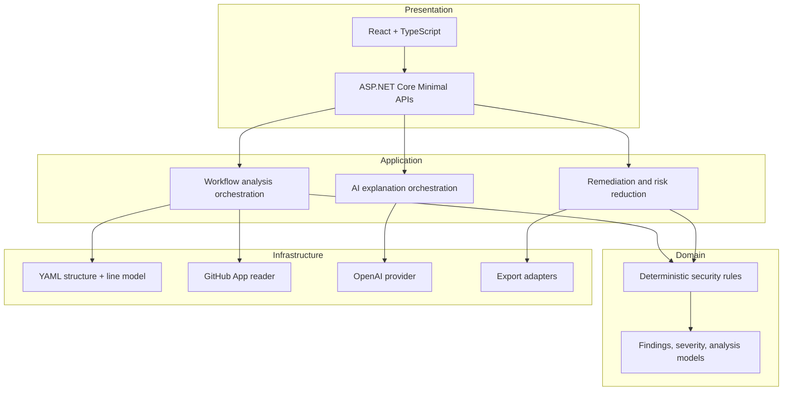
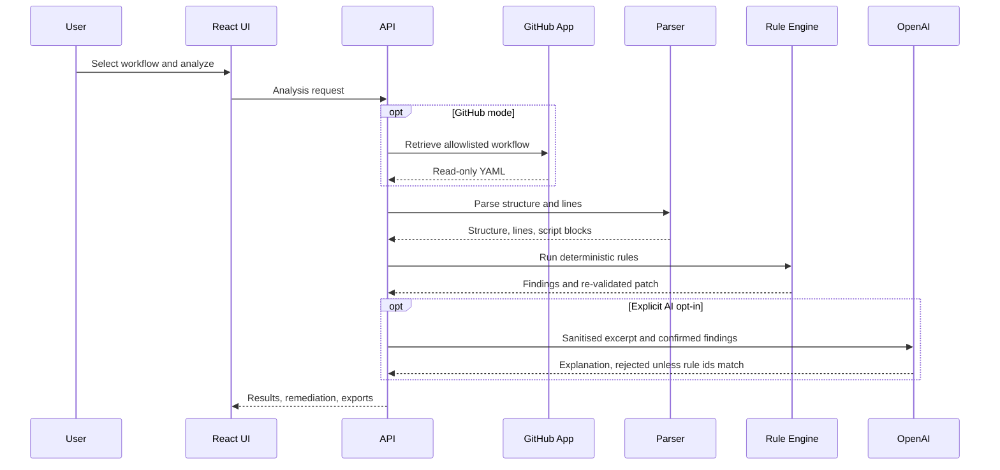

# Architecture

Layered so dependencies point inward. GitHub, OpenAI, export formatting and HTTP
concerns stay at the edges; the rules and the models they produce sit at the
centre and depend on nothing.

For what happens on a single request, see
[program-flow.md](program-flow.md). For the rules themselves, see
[rules.md](rules.md).

## Request pipeline

## Two views of one document

The parser produces a **structure**, read with YamlDotNet, and a **line model**.

Structure answers questions about relationships — which `with:` inputs belong to
which step, which permissions belong to which job — and carries the source line
of every element. Rules that reason about relationships read it, so flow
mappings, quoted keys, anchors and the YAML 1.1 treatment of `on` as a boolean
resolve the way GitHub resolves them.

Lines answer questions about content. YAML models a `run:` block as a single
opaque scalar, so per-line attribution inside it is unavailable from the
structure — and the script injection rule needs exactly that. Line-indexed
patching needs it too.

Block scalar bodies are withheld from the line model and captured separately,
because treating shell as YAML produced false positives and would have let the
patch generator rewrite a line inside a shell script.

A workflow the YAML parser rejects is reported invalid rather than partially
analysed. Returning findings from a document that could not be read would omit
whatever the malformed region contained, which is the one failure mode a
deterministic-first analyser cannot afford.

## Security design

- GitHub App permissions are limited to read-only code and metadata.
- Installation tokens are short-lived and cached only in memory.
- An application-level repository allowlist is a second, independent boundary.
- OpenAI receives sanitised excerpts and deterministic findings only.
- The model's response is schema-constrained, and its rule identifiers must match
  the deterministic set exactly or the response is discarded.
- Proposed YAML is re-analysed before a patch is declared valid, and a patch that
  introduces a finding is refused.
- An action reference that cannot be resolved is left untouched rather than
  rewritten with a placeholder that would look remediated.
- Correlation IDs, partitioned rate limiting, output caching, security headers
  and RFC 7807 errors support operations without logging secrets or workflow
  bodies. Request-supplied values are sanitised before they reach a log entry.

## Deliberate exclusions

No branches, commits, pull requests, merges or scheduled scans. No stored
history. Each would need a separate threat model, stronger authentication and new
GitHub permissions, so each is absent rather than half-built.

## Decisions

The choices behind this design are recorded in [`../adr/`](../adr/) — including
why deterministic rules are authoritative, why the AI is not a source of truth,
why the GitHub App is read-only, and why remediation stays a preview.
